# IMWG Indonesia: Aktivasi SENYAR-25

Repositori ini digunakan sebagai ruang kolaborasi **IMWG Indonesia** untuk mengelola tugas **data, pemetaan, dan informasi** terkait respons bencana **SENYAR-25**.

## Tujuan
- Mengubah data menjadi **aksi operasional** (data untuk dialog, peta untuk kolaborasi).
- Menjaga agar produk informasi **sinkron (waktu), sinergis (nilai tambah), dan terpadu**.
- Mendukung koordinasi lintas-aktor/klaster melalui produk yang mudah dipakai untuk pengambilan keputusan.

## Tautan Penting
- [Papan tugas bersama](https://github.com/orgs/IMWG-Indonesia/projects/1/views/1) - _melalui undangan_
- [Folder kerja/berkas bersama (cloud drive)](https://drive.google.com/drive/folders/1coaF3GzgR-J9uoUTN_8QGzr1psTHZPWD?usp=drive_link) - _melalui undangan_
- [Ruang diskusi threaded (Matrix/Element) – Room: `SENYAR-25`](https://matrix.to/#/!QzUYQmKmZkUjkpTgBy:matrix.org?via=matrix.org) - _melalui undangan_

## Cara Berkontribusi
Jika Anda ingin membantu:
1. **Cek papan tugas** dan pilih issue yang berlabel sesuai kapasitas (mis. `gis`, `data`, `mdc`, `infographic`, `qa-qc`).
2. Jika ada kebutuhan baru, **buat issue** menggunakan format micro-task berikut:
   - **Apa**: apa yang dikerjakan
   - **Tujuan**: untuk apa
   - **Hasil**: hasil yang diharapkan
   - **Format**: peta (PDF/PNG), dataset (CSV/GeoJSON), dashboard, dsb.
   - **Prioritas**: low/medium/high
   - **Deadline**:
   - **Data source**:
   - **Requester**:
3. Untuk diskusi, **posting link issue ke room Matrix/Element** dan gunakan thread agar 1 topik = 1 thread.

## Aturan Dasar Data (Ringkas)
- Setiap data/produk wajib mencantumkan minimal: **sumber**, **timestamp (as-of)**, dan **confidence**.
- **Default: tidak membagikan PII/data sensitif** (mis. nama/nomor HP individu) pada output publik. Data kontak untuk verifikasi disimpan terbatas sesuai persetujuan (consent).

## Kode Etik Kolaborasi
- Fokus pada kebutuhan operasional dan menghindari duplikasi kerja.
- Gunakan bahasa yang jelas, singkat, dan cantumkan asumsi/metodologi saat membuat peta/analisis.

# Aceh

```mermaid

timeline 
	title Status Tanggap Darurat Bencana Aceh (Banjir & Tanah Longsor) 
	
	section 29 Des 2025 (Senin) — Pembaruan Status 
		Pospenas/BNPB: 6 wilayah masuk fase Transisi Darurat → Pemulihan : 29/12/2025 
		Kab. Aceh Besar: masih proses penetapan Transisi Darurat → Pemulihan : 29/12/2025 
		11 wilayah: perpanjangan Status Tanggap Darurat : 29/12/2025 
		Provinsi Aceh: Status Tanggap Darurat berakhir : 08/01/2026 
		
	section Transisi Darurat → Pemulihan (6 wilayah) 
		Kab. Aceh Tenggara : 29/12/2025 
		Kab. Aceh Selatan : 29/12/2025 
		Kota Subulussalam : 29/12/2025 
		Kab. Aceh Singkil : 29/12/2025 
		Kota Langsa : 29/12/2025 
		Kota Lhokseumawe : 29/12/2025 
		
	section Perpanjangan Status Tanggap Darurat (11 wilayah) 
		Kab. Pidie : 29/12/2025 
		Kab. Pidie Jaya : 29/12/2025 
		Kab. Bireuen : 29/12/2025 
		Kab. Aceh Barat : 29/12/2025 
		Kab. Nagan Raya : 29/12/2025 
		Kab. Aceh Tengah : 29/12/2025 
		Kab. Gayo Lues : 29/12/2025 
		Kab. Bener Meriah : 29/12/2025 
		Kab. Aceh Utara : 29/12/2025 
		Kab. Aceh Timur : 29/12/2025 
		Kab. Aceh Tamiang : 29/12/2025 
		
	section 30 Des 2025 — Contoh Kondisi Lapangan & Fokus Penanganan 
		Kab. Aceh Tenggara: >1.600 pengungsi, layanan pos pengungsian masih berlangsung : 30/12/2025 
		Kota Lhokseumawe: banjir surut, pembersihan rumah/fasilitas umum/jalan oleh unsur daerah, warga & relawan : 30/12/2025 
		Kab. Aceh Utara: prioritas pembukaan akses jalan & normalisasi fasilitas pendidikan : 30/12/2025 
		
	section Hunian Sementara (Huntara) / Dana Tunggu Hunian 
		Identifikasi–verifikasi–validasi usulan huntara/dana tunggu hunian untuk rumah rusak berat (paralel dengan tanggap darurat) : 29/12/2025 
		Kab. Pidie & Kab. Pidie Jaya: proses pembangunan fisik huntara menggunakan BTT : 29/12/2025

```

